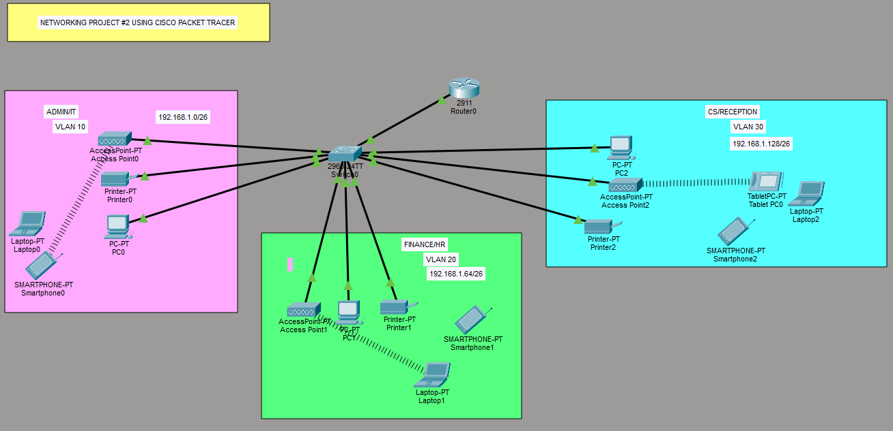
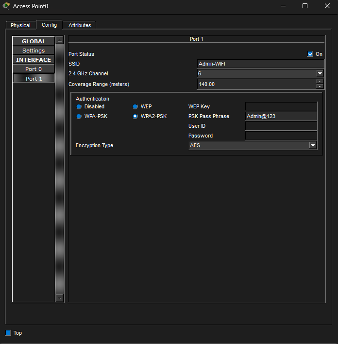
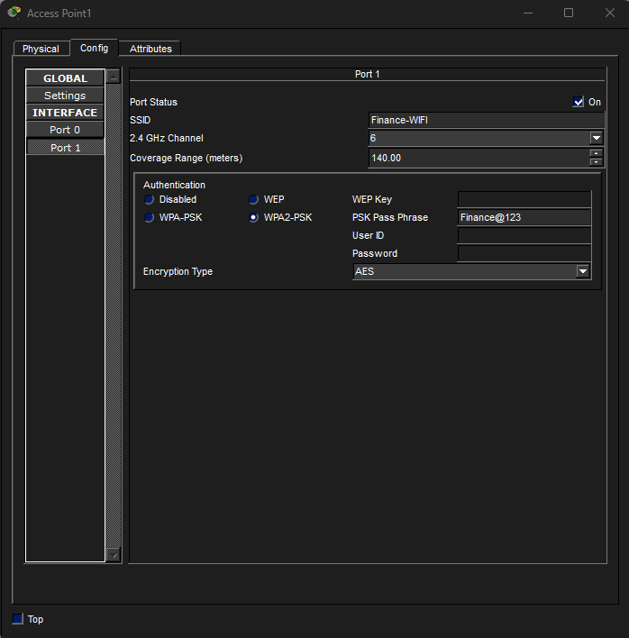
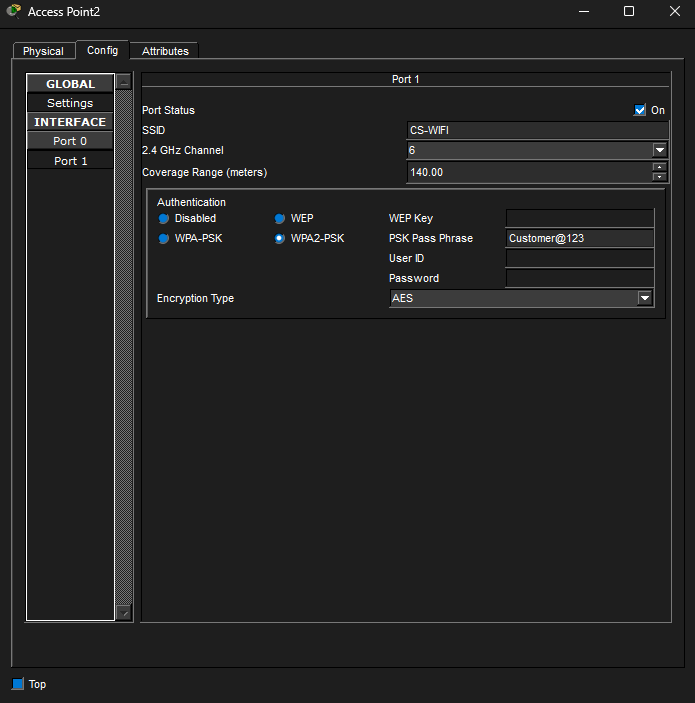
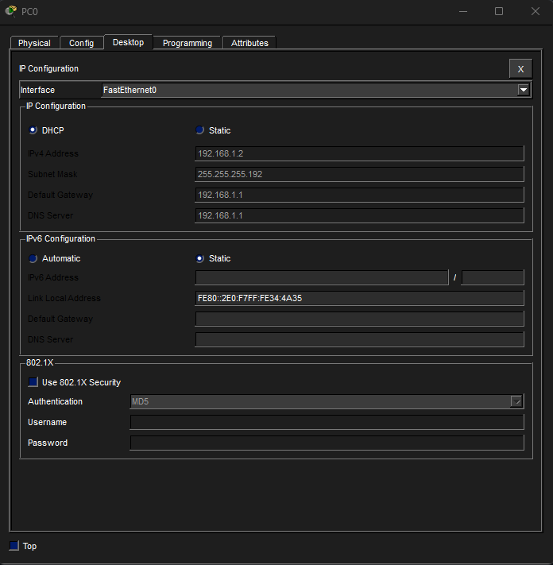
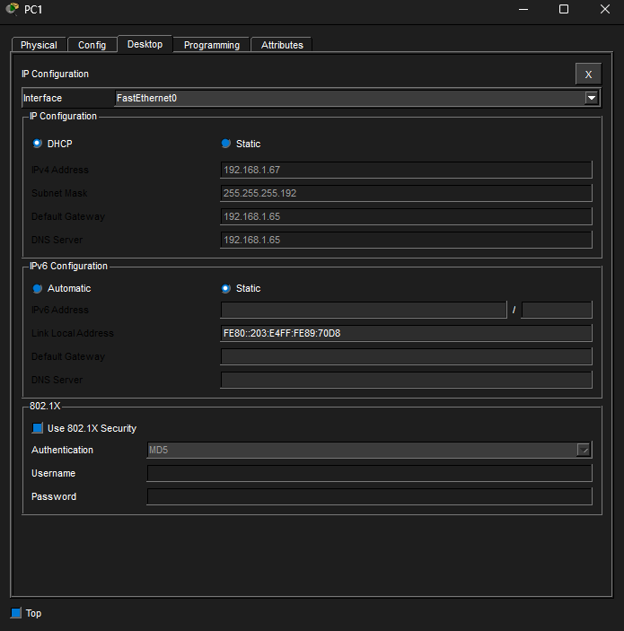
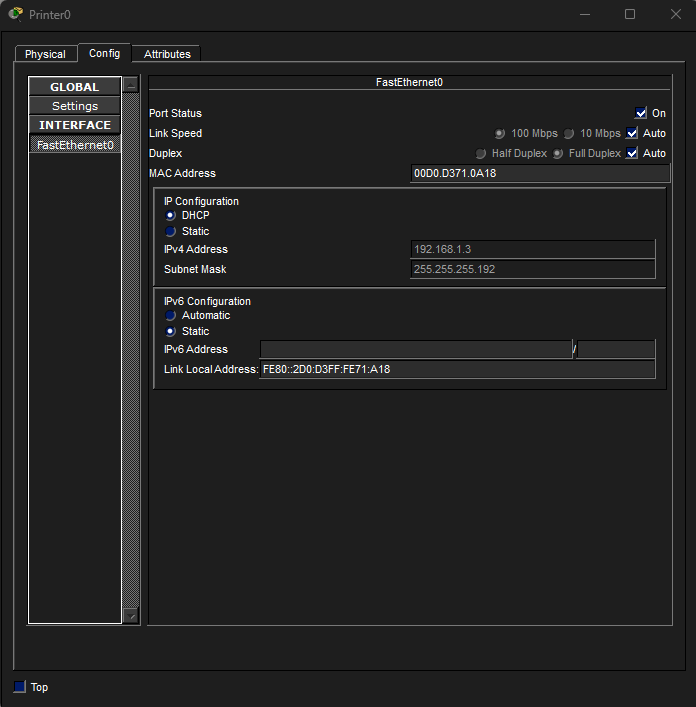
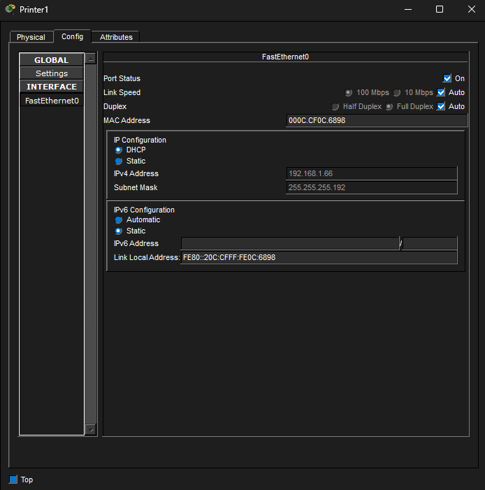
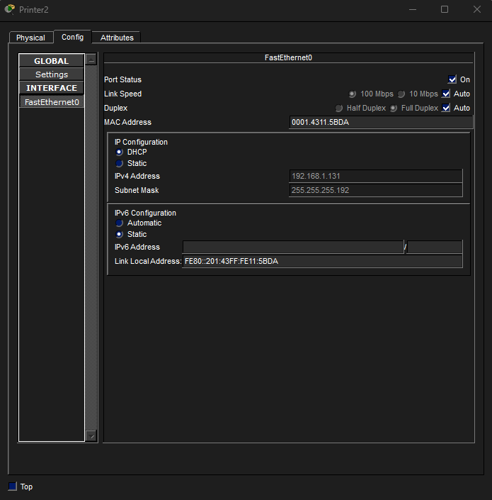

# SOHO Network Design & Implementation

**Enterprise Network Project**

---

## 1. Case Study

XYZ company is a fast-growing company in Eastern Australia with more than 2 million customers globally. The company deals with selling and buying of food items, which are basically operated from the headquarters. The company is intending to open a branch near the local village Bonalbo. Thus, the company requires young IT graduates  to design the  network for the branch. The network is intended to operate separately from the HQ network.

## 2. Requirements

- One Cisco router and one Cisco switch
- Three departments: **Admin/IT**, **Finance/HR**, **Customer Service/Reception**
- Each department on a separate VLAN
- Each department has its own wireless network
- Hosts obtain IPv4 addresses automatically (DHCP)
- All departments can communicate with each other
- ISP-assigned base network: `192.168.1.0`

## 3. Technologies Implemented

1. Simple network topology (1 router, 1 switch)
2. Correct cabling (straight-through / crossover / trunk as needed)
3. VLAN creation and port assignment
4. Subnetting and IP addressing
5. Inter-VLAN routing (router-on-a-stick)
6. DHCP server configuration (router as DHCP server)
7. WLAN / access point configuration
8. Host device configuration
9. Testing and verification

---

## 4. Network Topology



| Device | Role |
|---|---|
| Router0 | Router-on-a-stick, DHCP server |
| Switch (multilayer/L2) | VLAN trunking, access ports |
| Access Point 0/1/2 | Wireless per department |
| PC0, PC1, PC2 | Wired department hosts |
| Printer0/1/2 | Department printers |
| Laptop0/1/2, Smartphone0/1/2, Tablet PC0 | Wireless department clients |

---

## 5. IP Addressing Plan

Base network: `192.168.1.0/24`, subnetted into three `/26` blocks (2 borrowed bits → 4 subnets of 64 hosts each, 3 used).

| Department | VLAN | Subnet | Usable Range | Gateway (Router subinterface) | Broadcast |
|---|---|---|---|---|---|
| Admin/IT | 10 | 192.168.1.0/26 | .1 – .62 | 192.168.1.1 | 192.168.1.63 |
| Finance/HR | 20 | 192.168.1.64/26 | .65 – .126 | 192.168.1.65 | 192.168.1.127 |
| CS/Reception | 30 | 192.168.1.128/26 | .129 – .190 | 192.168.1.129 | 192.168.1.191 |


---

## 6. Configuration Summary

### 6.1 Switch — VLAN Creation & Access Ports

Created three VLANs and assigned access ports per department: Fa0/2–4 to
VLAN 10 (Admin/IT), Fa0/5–7 to VLAN 20 (Finance/HR), and Fa0/8–10 to VLAN 30
(CS/Reception). Packet Tracer auto-creates each VLAN the first time it's
referenced in a `switchport access vlan` command.

```
Switch>en
Switch#conf t
Enter configuration commands, one per line.  End with CNTL/Z.
Switch(config)#int range fa0/2-4
Switch(config-if-range)#switchport mode access
Switch(config-if-range)#switchport access vlan 10
% Access VLAN does not exist. Creating vlan 10
Switch(config-if-range)#exit
Switch(config)#int range fa0/5-7
Switch(config-if-range)#switchport mode access
Switch(config-if-range)#switchport access vlan 20
% Access VLAN does not exist. Creating vlan 20
Switch(config-if-range)#exit
Switch(config)#int range fa0/8-10
Switch(config-if-range)#switchport mode access
Switch(config-if-range)#switchport access vlan 30
% Access VLAN does not exist. Creating vlan 30
Switch(config-if-range)#exit
Switch(config)#do wr
Building configuration...
[OK]
```

### 6.2 Switch — Trunk Configuration

Set Fa0/1 (the uplink to the router) to trunk mode so all three VLANs' traffic
can pass to the router for inter-VLAN routing.

```
Switch>en
Switch#conf t
Enter configuration commands, one per line.  End with CNTL/Z.
Switch(config)#int fa0/1
Switch(config-if)#switchport mode trunk
Switch(config-if)#do wr
Building configuration...
[OK]
```

### 6.3 Router — Subinterfaces (Router-on-a-Stick)

Configured one subinterface per VLAN on the router's Gi0/0 link, each with
802.1Q encapsulation matching its VLAN ID and the gateway address for that
department's subnet.

```
Router>en
Router#conf t
Enter configuration commands, one per line.  End with CNTL/Z.
Router(config)#int g0/0
Router(config-if)#no sh
Router(config-if)#exit
Router(config)#int g0/0.10
Router(config-subif)#encapsulation dot1Q 10
Router(config-subif)#ip address 192.168.1.1 255.255.255.192
Router(config-subif)#exit
Router(config)#int g0/0.20
Router(config-subif)#encapsulation dot1Q 20
Router(config-subif)#ip address 192.168.1.65 255.255.255.192
Router(config-subif)#exit
Router(config)#int g0/0.30
Router(config-subif)#encapsulation dot1Q 30
Router(config-subif)#ip address 192.168.1.129 255.255.255.192
Router(config-subif)#do wr
Building configuration...
[OK]
```

### 6.4 Router — DHCP Pools

Configured one DHCP pool per department, scoped to its own /26 subnet, with
the router subinterface as both default gateway and DNS server.

```
Router(config)#service dhcp
Router(config)#ip dhcp pool Admin-Pool
Router(dhcp-config)#network 192.168.1.0 255.255.255.192
Router(dhcp-config)#default-router 192.168.1.1
Router(dhcp-config)#dns-server 192.168.1.1
Router(dhcp-config)#domain-name Admin.com
Router(dhcp-config)#exit
Router(config)#ip dhcp pool Finance-Pool
Router(dhcp-config)#network 192.168.1.64 255.255.255.192
Router(dhcp-config)#default-router 192.168.1.65
Router(dhcp-config)#dns-server 192.168.1.65
Router(dhcp-config)#domain-name Finance.com
Router(dhcp-config)#exit
Router(config)#ip dhcp pool CS-Pool
Router(dhcp-config)#network 192.168.1.128 255.255.255.192
Router(dhcp-config)#default-router 192.168.1.129
Router(dhcp-config)#dns-server 192.168.1.129
Router(dhcp-config)#domain-name CS.com
Router(dhcp-config)#exit
Router(config)#do wr
Building configuration...
[OK]
```

### 6.5 Access Points

Each department's AP was configured with its own SSID, mapped to its VLAN via
the corresponding access port on the switch.

**Access Point0 — Admin/IT (VLAN 10)**


**Access Point1 — Finance/HR (VLAN 20)**


**Access Point2 — CS/Reception (VLAN 30)**


### 6.6 End Device Verification

Each PC and printer was set to obtain an IPv4 address automatically. The
screenshots below confirm every device received an address from its
department's DHCP pool.

| Device | Department | Verification |
|---|---|---|
| PC0 | Admin/IT |  |
| PC1 | Finance/HR |  |
| PC2 | CS/Reception |  |
| Printer0 | Admin/IT |  |
| Printer1 | Finance/HR |  |
| Printer2 | CS/Reception |  |

All devices obtained IPv4 addresses automatically within their department's
subnet, confirming DHCP scoping is correct per VLAN.

---


## 7. Files in This Repo

- `soho-network-project2.pkt` — completed Packet Tracer file
- `screenshots/` — all configuration and verification screenshots
- `README.md` — this document

---
